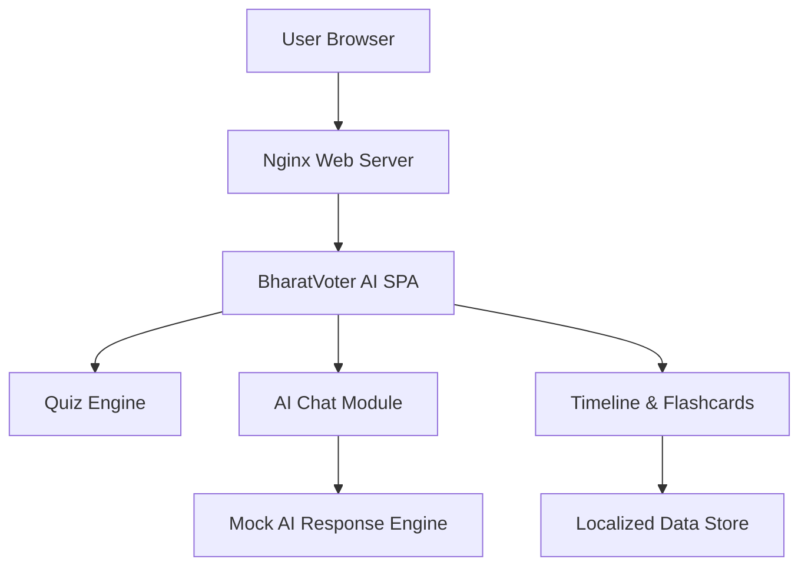
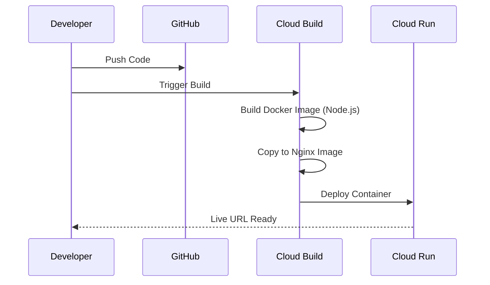

# BharatVoter AI 🗳️🇮🇳

BharatVoter AI is a premium, interactive educational assistant designed to help citizens understand the intricacies of the **Indian Election System**. From the Model Code of Conduct (MCC) to the final declaration of results, this tool provides a localized and engaging learning experience.

## ✨ Key Features

- **Interactive Election Timeline**: Visualize the various stages of the Indian General Elections, including Nomination, Polling Phases, and Counting.
- **AI-Powered Assistant**: A conversational AI trained to answer questions about voter registration, ECI roles, and electoral processes.
- **Educational Quiz Engine**: Test your knowledge with a dynamic MCQ system featuring real-time feedback and scoring.
- **Interactive Flashcards**: Learn key electoral terms (EVM, VVPAT, NOTA, etc.) through a sleek, touch-friendly interface.
- **Premium Design**: A responsive, glassmorphism-inspired dark mode aesthetic with Indian-themed accents.

## 🏗️ Architecture

The application is built with a focus on simplicity, performance, and scalability.



## 🛠️ Technology Stack

- **Frontend**: Vanilla JavaScript (ESM), HTML5, CSS3 (Custom Design System).
- **Build Tool**: [Vite](https://vitejs.dev/) for fast development and optimized production builds.
- **Containerization**: [Dockerfile](Dockerfile) with a multi-stage build (Node.js -> Nginx).
- **Deployment**: Hosted on **Google Cloud Run** for high availability and serverless scaling.

## 🚀 Deployment Pipeline



## 🌐 Live Demo

The application is deployed and accessible at:
[https://election-assistant-1046110827726.asia-south1.run.app](https://election-assistant-1046110827726.asia-south1.run.app)

## 🛠️ Local Development

1. **Clone the repository**:
   ```bash
   git clone https://github.com/Aessarrajabadi/Democracy-Style.git
   ```
2. **Install dependencies**:
   ```bash
   npm install
   ```
3. **Run development server**:
   ```bash
   npm run dev
   ```
4. **Build for production**:
   ```bash
   npm run build
   ```

---
Created with ❤️ for Indian Democracy.